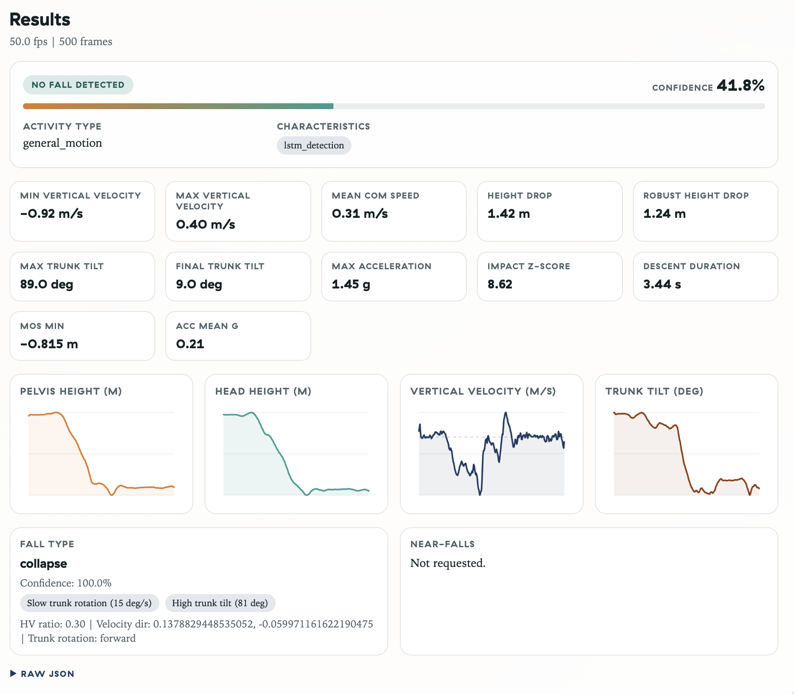

# Motion Capture Fall Detection System

Biomechanics-focused fall detection for 3D motion capture (C3D). Includes a rules-based detector and an LSTM model trained on windowed kinematic features.

## Highlights

- Rules-based detection grounded in literature (velocity, impact, trunk tilt, posture)
- LSTM sequence model with probability-based detection (reported 99.2% accuracy on internal data)
- Kinematic feature extraction: CoM, MoS, trunk tilt, velocities, accelerations
- Fall type and near-fall classifiers
- Flask API plus a static HTML UI

## Quick Start

```bash
python -m venv venv
source venv/bin/activate  # On Windows: venv\Scripts\activate
pip install -r requirements.txt
pip install torch  # Optional, for LSTM detector
python api/server.py
```

Open the UI at `http://localhost:5003/frontend/index.html`.

## API Example

```bash
curl -X POST -F "file=@recording.c3d" http://localhost:5003/api/v2/analyze
```

## Screenshots

UI preview (assets live in `docs/assets/`):




## Training

```bash
python training/train.py \
    --data-dir data/internal \
    --labels data/labels.json \
    --epochs 100 \
    --output models/lstm_fall_v1.pt
```

More details: `docs/TRAINING.md`.

## Documentation

- `docs/ARCHITECTURE.md`: system design and module dependencies
- `docs/REFERENCES.md`: scientific bibliography with DOIs
- `docs/THRESHOLDS.md`: detection thresholds and sources
- `docs/DATA_FORMAT.md`: data labeling schema
- `docs/API_REFERENCE.md`: REST API endpoints
- `docs/TRAINING.md`: ML training guide

## Requirements

- Python 3.8+
- Core dependencies in `requirements.txt`
- Optional: `torch` for the LSTM detector

## Author

Michael Conrad
AI Solutions Architect

## License

Free for research use.
